<!-- Improved compatibility of back to top link: See: https://github.com/othneildrew/Best-README-Template/pull/73 -->

<!-- PROJECT LOGO -->
 

  

<h3 align="center">Edubit</h3>

  

    Sell online courses.
     
  

<!-- ABOUT THE PROJECT -->
## About The Project

As a student of the Department of Information Technology at Hanoi University of Education, course K70, this page is the final paper of the Software Technology Laboratory subject.

## Screenshot User
1. Courses page
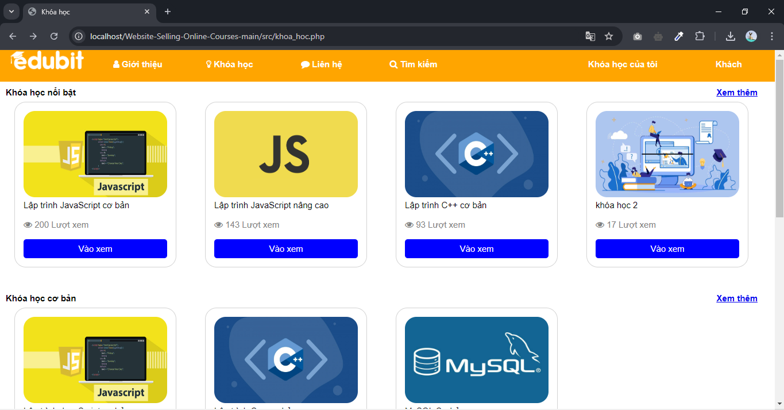

2. Login / Register
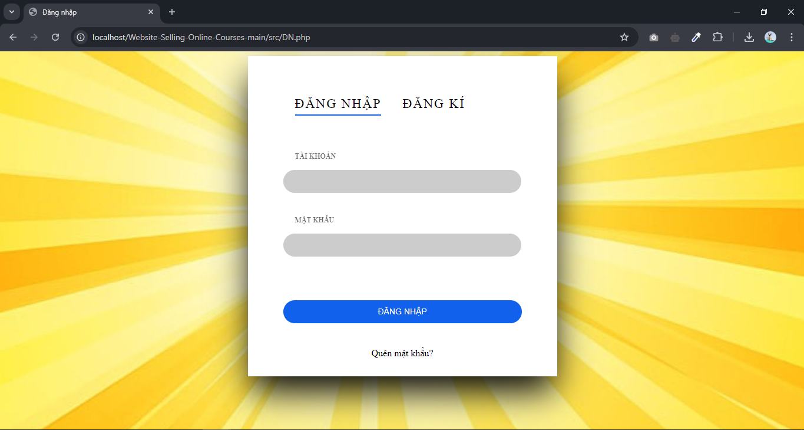
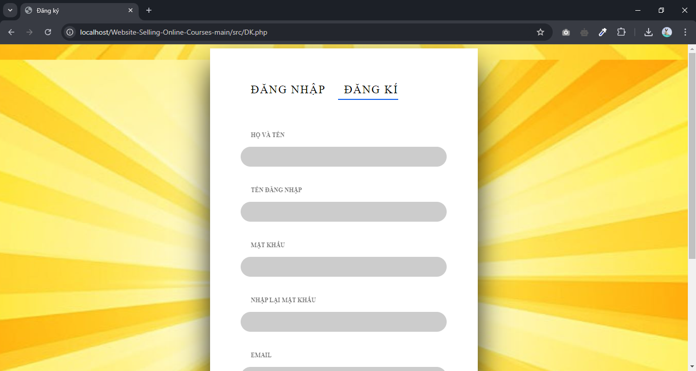

3. Search
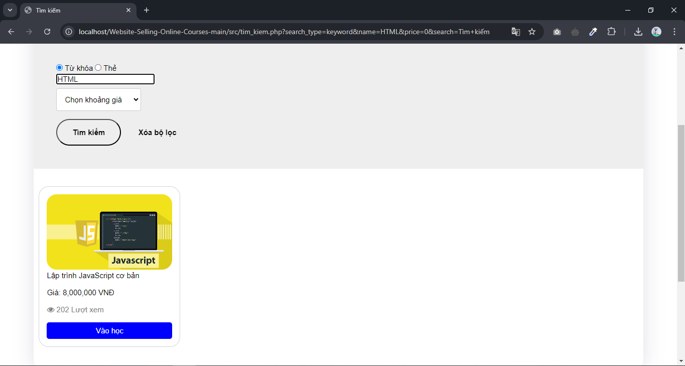

4. Buy courses
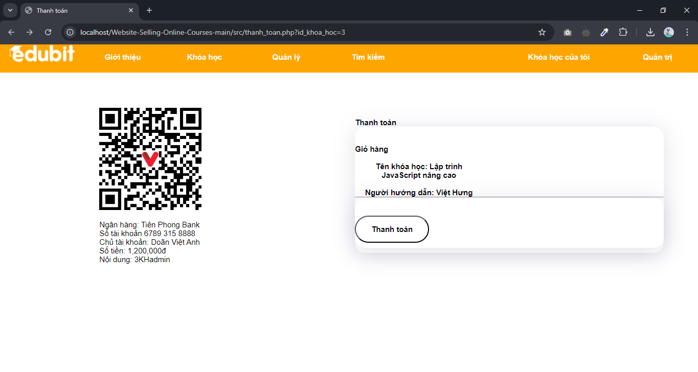

5. My Courses
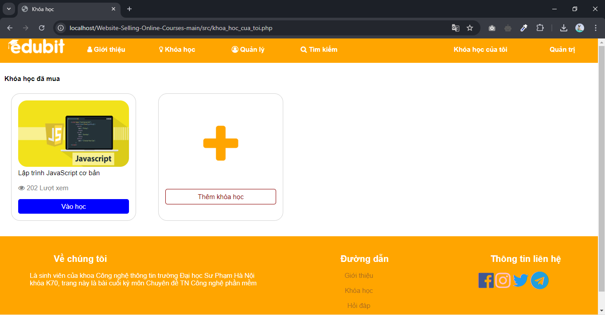

## Screenshot Admin
1. Manage Accounts
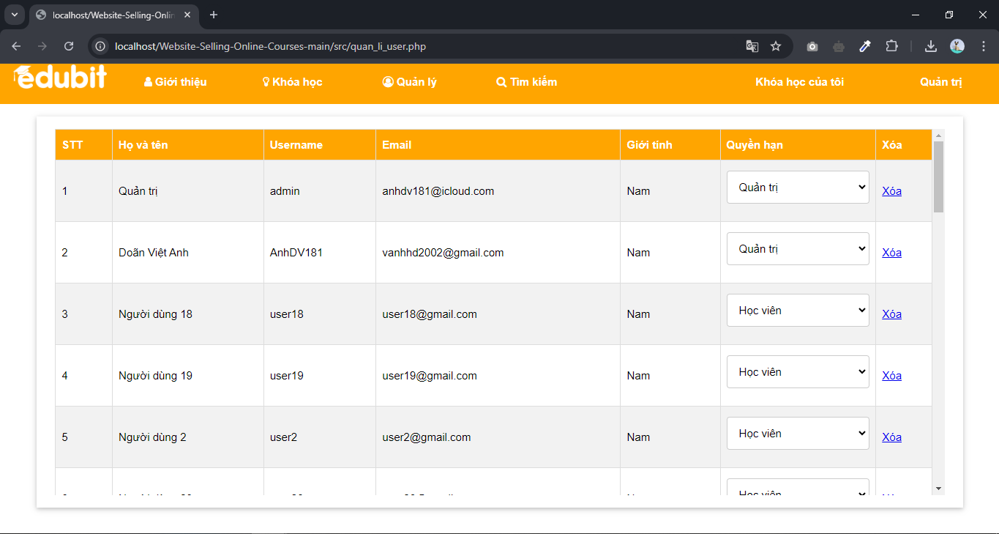

2. Manage courses
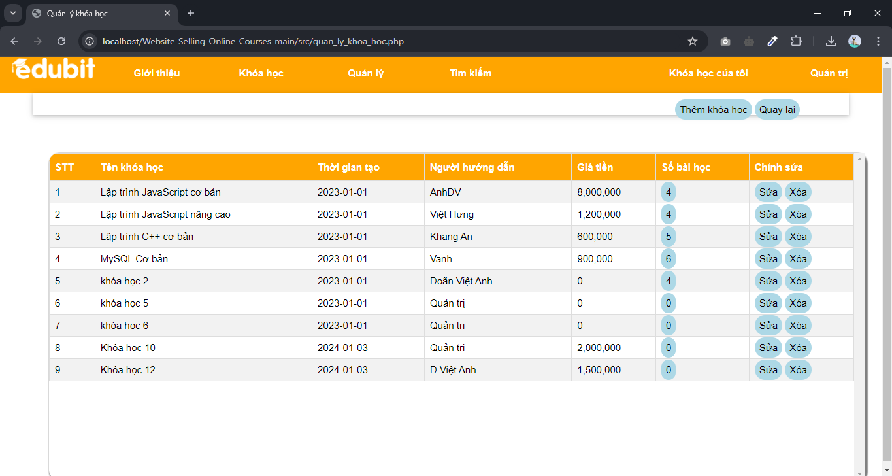

- Add courses
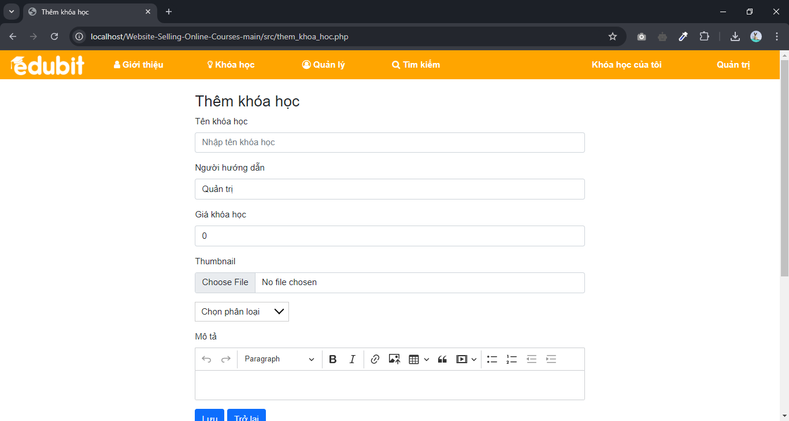

- Edit courses
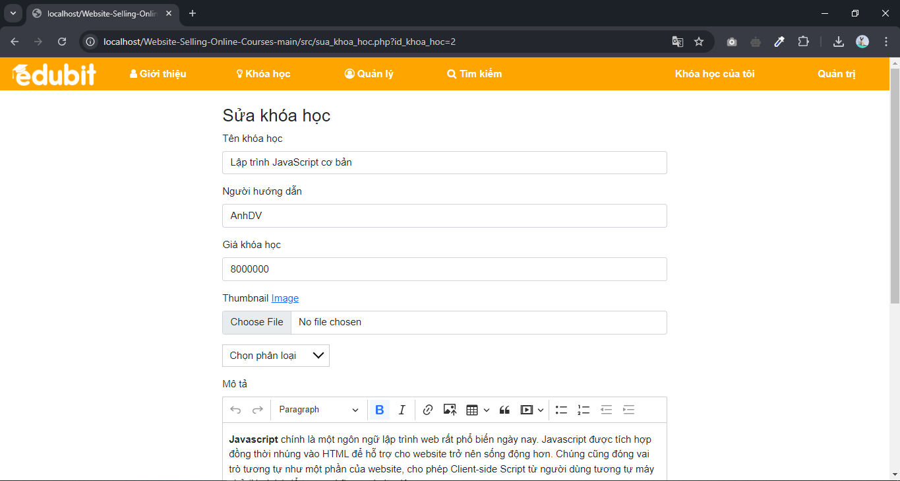

3. Manage lessons
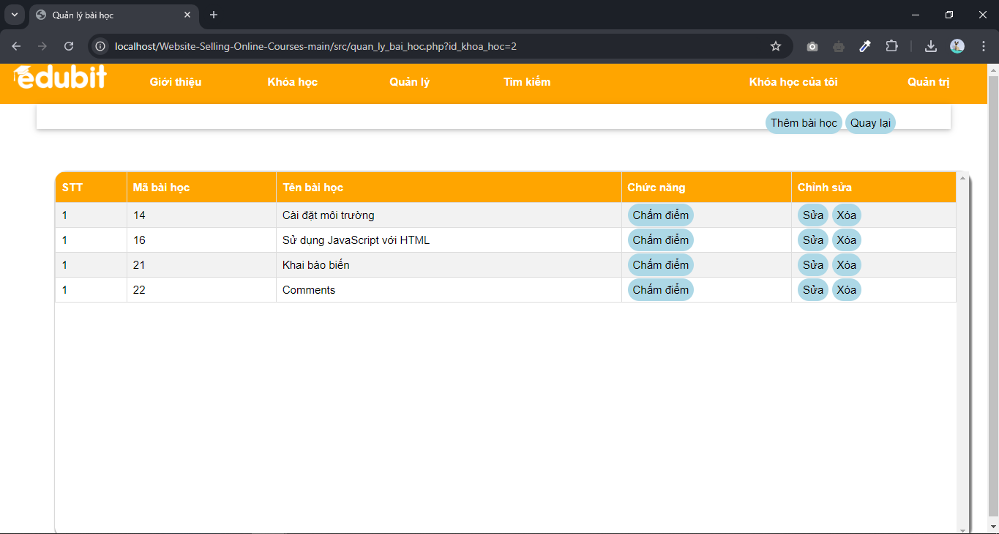

- Add lesson
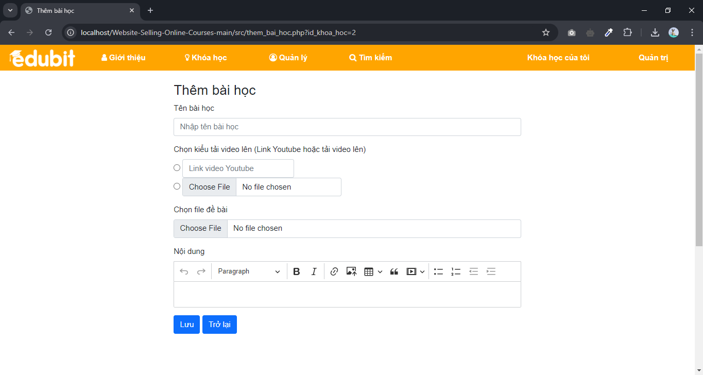

- Edit lesson
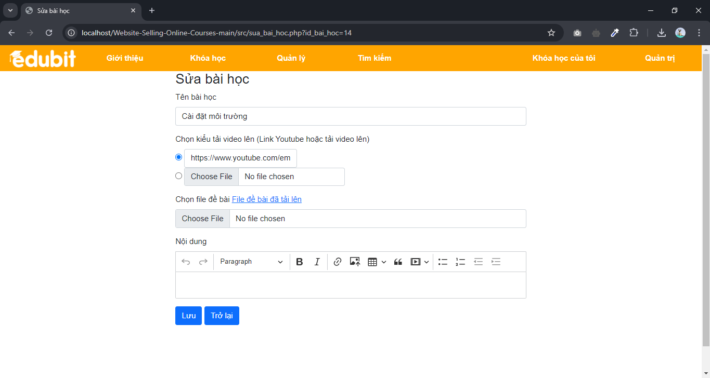

4. Grade user
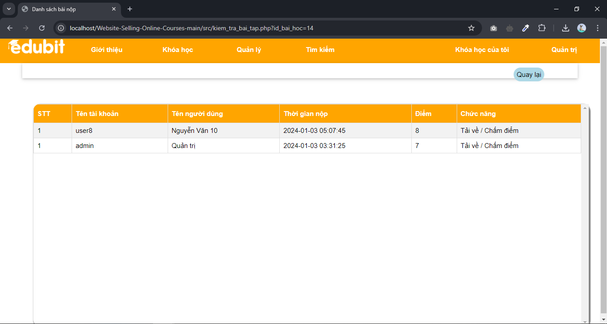
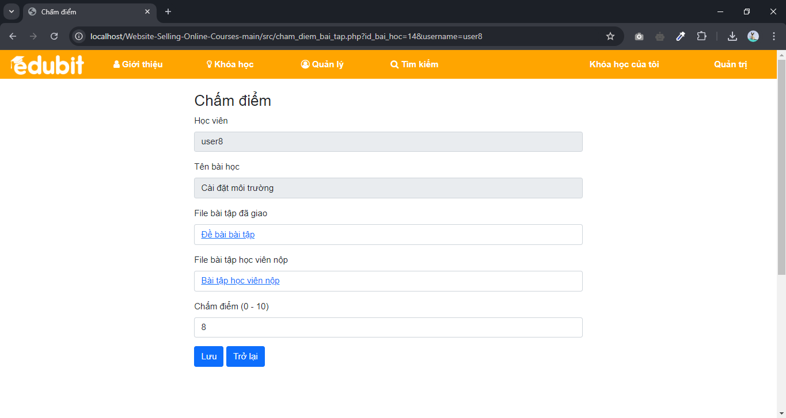

<!-- LICENSE -->
## License

Distributed under the MIT License. See `LICENSE.txt` for more information.

(<a href="#readme-top">back to top</a>)

<!-- CONTACT -->
## Contact

Doãn Việt Anh - anhdv.coder@gmail.com

Project Link: [https://github.com/AnhDVCoder/vn-in-mc](https://github.com/AnhDVCoder/vn-in-mc)

(<a href="#readme-top">back to top</a>)

